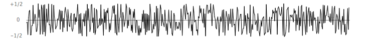

# 2. Guitar Hero

__Simulate the plucking of a guitar string.__ When a guitar string is plucked, the string vibrates and creates sound. The length of the string determines its fundamental frequency of vibration. We model a guitar string by sampling its displacement (a real number between -1/2 and +1/2) at N equally spaced points (in time), where N equals the sampling rate (44,100) divided by the fundamental frequency (rounding the quotient to the nearest integer).


- Plucking the string. The excitation of the string can contain energy at any frequency. We simulate the excitation with white noise: set each of the N displacements to a random real number between -1/2 and +1/2.



- The resulting vibrations. After the string is plucked, the string vibrates. The pluck causes a displacement which spreads wave-like over time. The Karplus-Strong algorithm simulates this vibration by maintaining a ring buffer of the N samples: the algorithm repeatedly deletes the first sample from the buffer and adds to the end of the buffer the average of the first two samples, scaled by an energy decay factor of 0.996.


__Why it works?__ The two primary components that make the Karplus-Strong algorithm work are the ring buffer feedback mechanism and the averaging operation.

- The ring buffer feedback mechanism. The ring buffer models the medium (a string tied down at both ends) in which the energy travels back and forth. The length of the ring buffer determines the fundamental frequency of the resulting sound. Sonically, the feedback mechanism reinforces only the fundamental frequency and its harmonics (frequencies at integer multiples of the fundamental). The energy decay factor (.996 in this case) models the slight dissipation in energy as the wave makes a roundtrip through the string.
- The averaging operation. The averaging operation serves as a gentle low-pass filter (which removes higher frequencies while allowing lower frequencies to pass, hence the name). Because it is in the path of the feedback, this has the effect of gradually attenuating the higher harmonics while keeping the lower ones, which corresponds closely with how a plucked guitar string sounds.

From a mathematical physics viewpoint, the Karplus-Strong algorithm approximately solves the [1D wave equation](https://en.wikipedia.org/wiki/Wave_equation), which describes the transverse motion of the string as a function of time.

__Part 1: Ring buffer.__ Your first task is to create a data type to model the ring buffer. Write a class named RingBuffer that implements the following API:

```
class RingBuffer:
---------------------------------------------------------------------------
def __init__(self, capacity):  # create an empty ring buffer, with given max capacity
def size(self):                # return number of items currently in the buffer
def isEmpty(self):             # is the buffer empty (size equals zero)?
def isFull(self):              # is the buffer full  (size equals capacity)?
def enqueue(self, x):          # add item x to the end
def dequeue(self):             # delete and return item from the front
def peek(self):                # return (but do not delete) item from the front
```

Since the ring buffer has a known maximum capacity, implement it using an array of that length. For efficiency, use _cyclic wrap-around_: Maintain one integer instance variable `first` that stores the index of the least recently inserted item; maintain a second integer instance variable `last` that stores the index one beyond the most recently inserted item. To insert an item, put it at index `last` and increment `last`. To remove an `item`, take it from index `first` and increment `first`. When either index equals capacity, make it wrap-around by changing the index to 0.

Implement RingBuffer to throw a `RuntimeException` if the client attempts to `dequeue()` or `peek()` an empty buffer, or `enqueue()` into a full buffer.


__Part 2: Guitar string.__ Next, create a data type to model a vibrating guitar string. Write a class named `GuitarString` that implements the following API:

```
class GuitarString
-------------------------------------------------------------------------------
"""
Create a guitar string of the given frequency, using a sampling rate of 44,100 if provided. Raise an exception if frequency is None.
"""
def __init__(self, frequency) 

def pluck(self):                         # set the buffer to white noise
def tic(self):                           # advance the simulation one time step
def sample(self):                        # return the current sample
def time(self):                          # return number of tics
```

- _Constructors._ Create a `GuitarString` object.
    - The constructor creates a `RingBuffer` of the desired capacity _N_ (sampling rate 44,100 divided by frequency, rounded to the nearest integer), and initializes it to represent a guitar string at rest by enqueueing N zeros.
- _Pluck._ Replace the _N_ items in the ring buffer with N random values between -0.5 and +0.5.
- _Tic._ Apply the Karplus-Strong update: delete the sample at the front of the ring buffer and add to the end of the ring buffer the average of the first two samples, multiplied by the energy decay factor.
- _Sample._ Return the value of the item at the front of the ring buffer. If the buffer is empty, return 0.
- _Time._ Return the total number of times `tic()` was called.

__Interactive guitar player.__ [guitar_hero_lite.py](guitar_hero_lite.py) is a sample `GuitarString` client that plays the guitar in real-time, using the keyboard to input notes. When the user types the lowercase letter `'a'` or `'c'`, the program plucks the corresponding string. Since the combined result of several sound waves is the superposition of the individual sound waves, we play the sum of all string samples.

```

from guitar_string import GuitarString
import stdaudio
import stddraw

if __name__ == "__main__":
    # Create two guitar strings, for concert A and C

    CONCERT_A = 440.0
    CONCERT_C = CONCERT_A * (2 ** 3.0/12.0)   
    stringA =  GuitarString(CONCERT_A)
    stringC =  GuitarString(CONCERT_C)

    while True:

      # check if the user has typed a key if so, process it   
        if (StdDraw.hasNextKeyTyped()):
            key = StdDraw.nextKeyTyped()
            if key == 'a':
                stringA.pluck() 
            elif key == 'c': 
                stringC.pluck()
      

      # compute the superposition of samples
      sample = stringA.sample() + stringC.sample()

      # play the sample on standard audio
      StdAudio.play(sample)

      # advance the simulation of each guitar string by one step   
      stringA.tic()
      stringC.tic()
```

Edit the program `guitar_hero_lite.py` so that it supports a total of 37 notes on the chromatic scale from 110Hz to 880Hz. In general, make the ith character of the string
```
keyboard = "q2we4r5ty7u8i9op-[=zxdcfvgbnjmk,.;/' ";
```
This keyboard arrangement imitates a piano keyboard: The "white keys" are on the qwerty and zxcv rows and the "black keys" on the 12345 and asdf rows of the keyboard.


The ith character of the string corresponds to a frequency of 440 × 2<sup>(i - 24)/ 12</sup> , so that the character 'q' is 110Hz, 'i' is 220Hz, 'v' is 440Hz, and ' ' is 880Hz. Don't even think of including 37 individual `GuitarString` variables or a 37-way if statement! Instead, create an array of 37 `GuitarString` objects and use `keyboard.indexOf(key)` to figure out which key was typed. Make sure your program does not crash if a key is played that is not one of your 37 notes.

__Submission.__ Comlete `ring_buffer.py`, `guitar_string.py`, and `guitar_hero_lite.py`. You will know your solution is complete when [guitar_hero_lite.py](guitar_hero_lite.py) can play music! 
