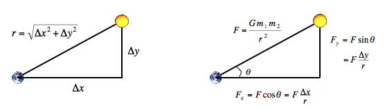

# Practice Assignment 1 - N-Body Simulation

In 1687 Sir Isaac Newton formulated the principles governing the the motion of two particles under the influence of their mutual gravitational attraction in his famous Principia. However, Newton was unable to solve the problem for three particles. Indeed, in general, solutions to systems of three or more particles must be approximated via numerical simulations. Your challenge is to write a program to simulate the motion of N particles in the plane, mutually affected by gravitational forces, and animate the results. Such methods are widely used in cosmology, semiconductors, and fluid dynamics to study complex physical systems. Scientists also apply the same techniques to other pairwise interactions including Coulombic, Biot-Savart, and van der Waals.

__The physics.__ We review the equations governing the motion of the particles, according to Newton's laws of motion and gravitation. Don't worry if your physics is a bit rusty; all of the necessary formulas are included below. We'll assume for now that the position (r<sub>x</sub>, r<sub>y</sub>) and velocity (v<sub>x</sub>, v<sub>y</sub>) of each particle is known. In order to model the dynamics of the system, we must know the net force exerted on each particle.

- __Pairwise force.__ _Newton's law of universal gravitation_ asserts that the strength of the gravitational force between two particles is given by the product of their masses divided by the square of the distance between them, scaled by the gravitational constant _G_ (6.67 × 10-11 N m<sup>2</sup> / kg<sup>2</sup>). The pull of one particle towards another acts on the line between them. Since we are using Cartesian coordinates to represent the position of a particle, it is convenient to break up the force into its x- and y-components (F<sub>x</sub>, F<sub>y</sub>) as illustrated below 
- __Net force.__ The _principle of superposition_ says that the net force acting on a particle in the x- or y-direction is the sum of the pairwise forces acting on the particle in that direction.
- __Acceleration.__ _Newton's second law of motion_ postulates that the accelerations in the x- and y-directions are given by: _a<sub>x</sub> = F<sub>x</sub> / m, a<sub>y</sub> = F<sub>y</sub> / m._

__The numerics.__  We use the _leapfrog finite difference approximation scheme_ to numerically integrate the above equations: this is the basis for most astrophysical simulations of gravitational systems. In the leapfrog scheme, we discretize time, and update the time variable t in increments of the _time quantum_ _Δt_ (measured in seconds). We maintain the position (r<sub>x</sub>, r<sub>y</sub>) and velocity (v<sub>x</sub>, v<sub>y</sub>) of each particle at each time step. We will go over later in detail how to evolve the positions and velocities of the particles.

__Your program.__ Write a program `nbody.py` that:

- Reads two double _command-line arguments_ _T_ and _Δt_.
- Reads in the universe from standard input using [stdio.py](../../stdio.py)
- Simulates the universe, starting at time _t_ = 0.0, and continuing as long as _t < T_, using the leapfrog scheme described above.
- Animates the results to standard drawing using [stddraw.py](../../stddraw.py).


Lets get started! First thing on our todo list is to read two _command-line arguments_ and store them in our program. To do this we will need help from a python library called sys - write 
```
import sys
``` 
at the top of your n_body.py program. 
Next lets define a main method that will run when we call n_body.py from the command line.
```
def main():
```

Now lets go ahead and write some code in the main method in order to store _T_ and Δ_t_ :
```
sys.argv[1] 
sys.argv[2]
```
We use indexes 1 and 2 because they are the 2nd and 3rd argument given in the command line respectively (the 1st argument being the name of the file to run - n_body). Store these values in variables and feel free to name them whatever you prefer.

Now that that is taken care of, we now want to implement several parallel arrays to store important data about the planets. We get this data from a text file which is described in more detail below. 

__Input format.__ The input format is a text file that contains the information for a particular universe. The first value is an integer _N_ which represents the number of particles. The second value is a real number _R_ which represents the radius of the universe: assume all particles will have x- and y-coordinates that remain between _-R_ and _R_. Finally, there are _N_ rows, and each row contains 6 values. The first two values are the x- and y-coordinates of the initial position; the next pair of values are the x- and y-components of the initial velocity; the fifth value is the mass; the last value is a String that is the name of an image file used to display the particle. As an example, [planets.txt](planets.txt) contains data for our solar system (in SI units).

```
% more planets.txt
5
2.50e+11
 1.4960e+11  0.0000e+00  0.0000e+00  2.9800e+04  5.9740e+24    earth.gif
 2.2790e+11  0.0000e+00  0.0000e+00  2.4100e+04  6.4190e+23     mars.gif
 5.7900e+10  0.0000e+00  0.0000e+00  4.7900e+04  3.3020e+23  mercury.gif
 0.0000e+00  0.0000e+00  0.0000e+00  0.0000e+00  1.9890e+30      sun.gif
 1.0820e+11  0.0000e+00  0.0000e+00  3.5000e+04  4.8690e+24    venus.gif
```

You should read in __exactly__ as many rows of body information as are indicated by _N_, the first value in the file.

Use : ```sys.stdin.readline() ``` to read in the lines one at a time. I would recommend using .split() to separate these lines into more usable chunks of information. [See an example using .split() here](https://www.w3schools.com/python/ref_string_split.asp). Make sure to put similiar values of all the planets into the same parallel arrays. And you should have 6 arrays total.

To make the computer simulation, write a loop that repeatedly updates the position and velocity of the particles. Before plotting, use `stddraw.setXscale(-R, +R)` and `stddraw.setYscale(-R, +R)` to scale the physics coordinates to the screen coordinates.

You will need to update the coordinates of all the planets every iteration of your loop. 
```
def update_coords(cur_planet,x,y,vX,vY,mass,dT):
    """
    :cur_planet - the current planet whose coords you want to update
    :x,y,vX,vY,mass - all parallel arrays with the respecting planet information
    :dT - change in time, the amount of time that increases for each iteration of your loop
    :this function updates the x and y velocity as well as the x and y coordinates of the current planet
    :return: None
    """
    
```
All you have to do is fill out this function and call it once per planet for each iteration in your loop. 

Lets go through the steps of defining this function. You may have noticed earlier that Newtons method makes use of a gravitational constant. Lets go ahead and define that now `GRAVITATIONAL_CONSTANT = 6.67e-11` . Next lets calculate the total force thats acting on our planet in both the x and y plane. Create a loop to loop through all of our planets and make sure not to calculate the force from our current planet onto itself (skip over this element in your loop). For each iteration use the pictures above to calculate the Net Force on X and Net Force on Y(requires calculating distance) and keep a running total of these values. 

After your loop calculate the acceleration for x and y based on above diagrams (relies on total Force).

Then calculate velocity (relies on acceleration) and position. Update both accordingly for your current planet.

Now that we have a working function to update our planets, we need to worry about displaying them. Next create a function called display and call it once at the end of each iteration of your loop. With the following signature:

```
def display(xCoords, yCoords, gifs):
    """
    :xCoords - parallel array of floats containing all the planet's xCoordinates
    :yCoords - parallel array of floats containing all the planet's yCoordinates
    :gifs - parallel array corresponding to the pictures associated with each planet
    :this function should use stddraw to display all of the planets
    :return type: None
    """
```


As an example, you can use the following code to set up the background  

```
background = Picture('starfield.jpg')'
stddraw.picture(background,0,0)
```

Then you can draw the planets similiarly. Also dont forget your imports - ```import stddraw```and ```from picture import Picture```.

Then to display the picture to the screen ```stddraw.show(TIME_TO_WAIT)``` where TIME_TO_WAIT is an integer in milleseconds of time for stddraw to pause after displaying to the screen. 


__Compiling and executing your program.__ To compile your program from the command line, type:

```
python nbody.py 157788000.0 25000.0 < planets.txt

5
2.50e11
 1.4925e+11 -1.0467e+10  2.0872e+03  2.9723e+04  5.9740e+24    earth.gif
-1.1055e+11 -1.9868e+11  2.1060e+04 -1.1827e+04  6.4190e+23     mars.gif
-1.1708e+10 -5.7384e+10  4.6276e+04 -9.9541e+03  3.3020e+23  mercury.gif
 2.1709e+05  3.0029e+07  4.5087e-02  5.1823e-02  1.9890e+30      sun.gif
 6.9283e+10  8.2658e+10 -2.6894e+04  2.2585e+04  4.8690e+24    venus.gif
```

If you are using windows powershell you may have to try using 

```
cmd /c 'python n_body.py 157788000.0 25000.0 < planets.txt'
```

You may also have to install pygame using pip as well as pynput.

```
pip install pygame
pip install pynput
```

You can also try with [pluto.txt](pluto.txt) or any of the other text files provided! You will know if your program is working if your solar system when running the above code displays a functioning solar system. 

